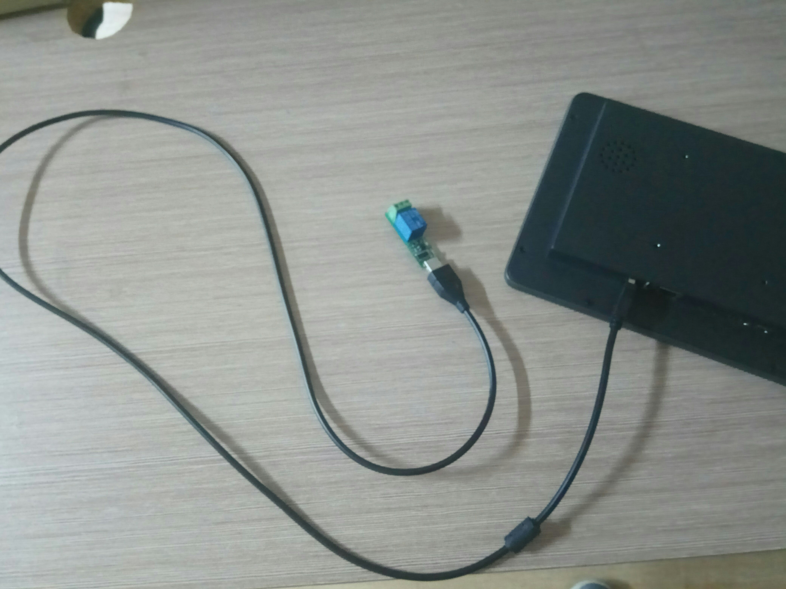
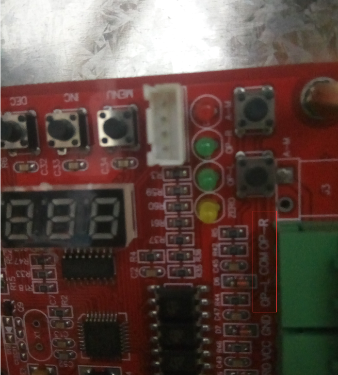
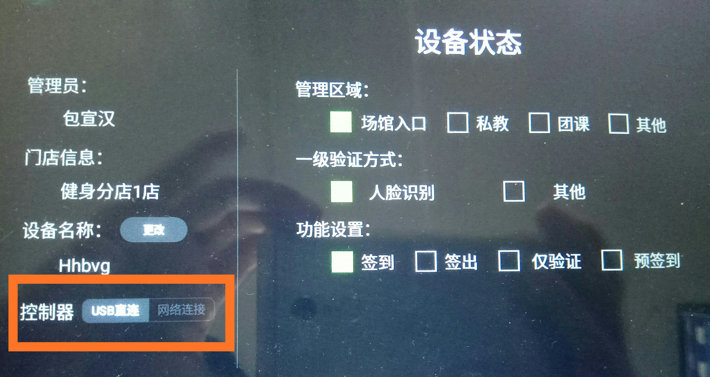

# 菠菜智能USB连接模式

**1.   将USB线的一头接到平板设备的USB接口上，另一头接到中继器上，然后将中继器放到闸机机箱内，以便与闸机的控制电路板连接。**

**2.用电线将中继器的 COM端 和 闸机的主板COM端连接，再将中继器的 NO 端和 闸机主板的 OP-L（左开）或者 是OP-R（右开） 连接。（备注：有些闸机主板的COM端会被标注为中文字：公共端，OP-L标注为：左开闸，OP-R标注为中文字：右开闸。）**

**中继器端口示意图：** 

  
闸机主板示意图：

**3.设备上电后将其配置为USB直连模式即可进行人脸识别开闸。**

  

